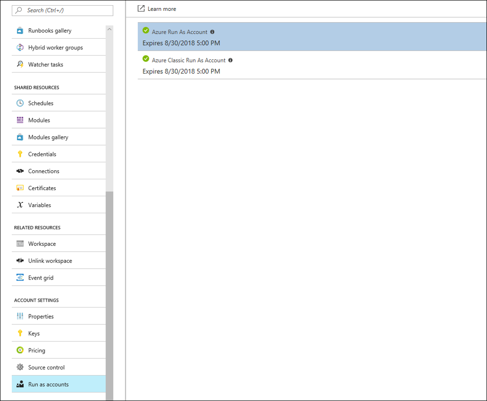
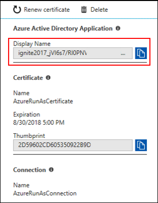
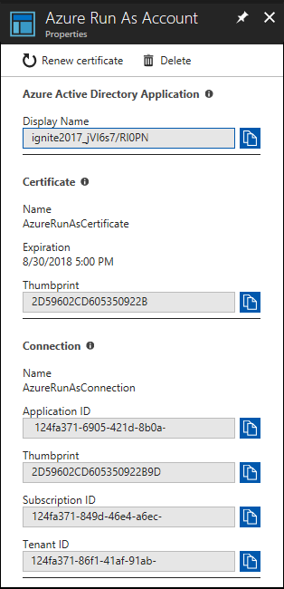

# Azure Automation python emulated assets

This python module enables the development and testing of Azure Automation python runbooks in an offline experience using the built-in Automation assets (variables, credentials, connections, and certificates). You can learn more about [python support](https://docs.microsoft.com/en-us/azure/automation/automation-first-runbook-textual-python2) in the Azure Automation documentation.

This emulated module supports the following functions:
* get_automation_variable
* set_automation_variable
* get_automation_credential
* get_automation_connection
* get_automation_certificate

The local values should be entered into the localassets.json file as these values are read by the emulated python automationassets module for the functions. You should keep this file secure if it contains sensitive information.

### Using the emulated automationassets module

* Copy the [automationassets](automationassets/automationassets.py) and [localasets](automationassets/localassets.json) files into the directory where you are authoring python runbooks.
* Author python runbooks and call the previous functions like you would when running within the Automation service.

* For example, you should be able to create a new python file with the following code and run it locally.

```python
import automationassets

print automationassets.get_automation_variable("myvariable")

cred = automationassets.get_automation_credential("mycredential")
print cred['username']
print cred['password']
```

You can get additional [sample python runbooks](https://github.com/azureautomation/runbooks/tree/master/Utility/Python) from github that shows how to use the automation assets.

## Enabling use of Azure Automation RunAs account locally for authenticating to Azure

In order to authenticate with Azure resources, Azure Automation creates a [RunAs service principal](https://docs.microsoft.com/en-us/azure/automation/automation-create-runas-account). This service principal uses certificate-based authentication. Use the following steps to add another certificate to the service principal that is used for authentication from the development machine.

### Install Azure CLI

* Download and install [Azure CLI](https://docs.microsoft.com/en-us/cli/azure/install-azure-cli?view=azure-cli-latest) on your Windows or Linux computer.
* Authenticate to your Azure subscription by running:

```bash
az login
```

### Create new certificate and add it to the existing service principal used for the automation account

* Get the Azure Automation RunAs service principal name from the Azure Automation account




* Create and add a new certificate to this service principal using the name copied from the portal. You need to be the owner of this service principal or be an administrator in the Azure active directory. If you created the RunAs during Automation account creation, then you are an owner.

```bash
az ad sp reset-credentials --name ignite2017_jVI6s7/RI0PAAXv4A33BCDDYY12= --append --create-cert
```

### Get the thumbprint of certificate created. The location of the certificate file is returned by the previous call if successful

```bash
openssl x509 -noout -in /home/user/tmpbtxnq3vs.pem -fingerprint
```

### Export the certificate as pkcs12 since that is used within Automation accounts for the RunAs. Specify any password when prompted.

```bash
openssl pkcs12 -export -in /home/user/runas.pem -out hybrid_runas.pfx
```

* You can now copy the thumbprint, location of the pfx file, and the password used into the certificate object in [localassets.json](automationassets/localassets.json)

### Update the AzureRunAsConnection object to the correct values in localassets.json

* Get the ApplicationId, SubscriptionId, and TenantId from the RunAs account in the Azure Automation account in the portal.



* Modify the AzureRunAsConnection object in the [localassets.json](automationassets/localassets.json) file with these values. Update the thumbprint with the value of your local thumbprint and not the one from the portal.

### Testing the local RunAs service principal

* Install the latest Azure python sdk

```python
pip install --pre azure
```
* Create a new python script from the following code and run it

```python
""" Tutorial to show how to authenticate against Azure resource manager resources """
import azure.mgmt.resource
import automationassets


def get_automation_runas_credential(runas_connection):
    """ Returns credentials to authenticate against Azure resoruce manager """
    from OpenSSL import crypto
    from msrestazure import azure_active_directory
    import adal

    # Get the Azure Automation RunAs service principal certificate
    cert = automationassets.get_automation_certificate("AzureRunAsCertificate")
    pks12_cert = crypto.load_pkcs12(cert)
    pem_pkey = crypto.dump_privatekey(crypto.FILETYPE_PEM, pks12_cert.get_privatekey())

    # Get run as connection information for the Azure Automation service principal
    application_id = runas_connection["ApplicationId"]
    thumbprint = runas_connection["CertificateThumbprint"]
    tenant_id = runas_connection["TenantId"]

    # Authenticate with service principal certificate
    resource = "https://management.core.windows.net/"
    authority_url = ("https://login.microsoftonline.com/" + tenant_id)
    context = adal.AuthenticationContext(authority_url)
    return azure_active_directory.AdalAuthentication(
        lambda: context.acquire_token_with_client_certificate(
            resource,
            application_id,
            pem_pkey,
            thumbprint)
    )


# Authenticate to Azure using the Azure Automation RunAs service principal
runas_connection = automationassets.get_automation_connection("AzureRunAsConnection")
azure_credential = get_automation_runas_credential(runas_connection)

# Intialize the resource management client with the RunAs credential and subscription
resource_client = azure.mgmt.resource.ResourceManagementClient(
    azure_credential,
    str(runas_connection["SubscriptionId"]))

# Get list of resource groups and print them out
groups = resource_client.resource_groups.list()
for group in groups:
    print group.name
```
